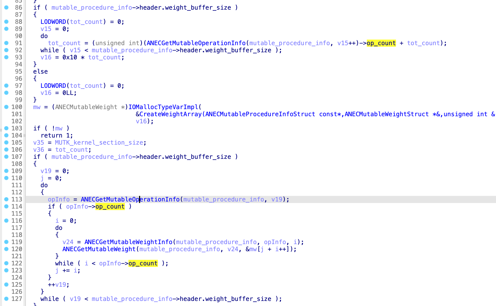

# CVE-2022-32932
ZinComputeProgramUpdateMutables() OOB write due to double fetch issue
## Analysis:

H11ANEIn::patchMutableSurface() (reachable from H11ANEIn::ANE_ProgramSendRequest_gated) is called if the model.hwx has a mutable procedure and has also initInfo section, I looked for such a model but couldn’t find any, so I ended up patching one of the pre-compiled models and used CVE-2022-32845 to load it. Please keep in mind that CVE-2022-32845 is not required to reach the vulnerable code path from the default app sandbox, it is sufficient to compile a custom mlmodel to achieve the same results. You can find more details about CVE-2022-32845 in my [presentation slides](https://github.com/ox1111/weightBufs/blob/main/attacking_ane_poc2022.pdf)

ZinComputeProgramUpdateMutables() is another function that’s called by H11ANEIn::patchMutableSurface() and the function prototype is the following:
```
ZinComputeProgramStatus __cdecl ZinComputeProgramUpdateMutables(
        uint64_t procedureId,
        const ZinComputeProgramInitInfo *init_info,
        const ANECMutableProcedureInfo *mutable_procedure_info,
        uint64_t mut_procedure_info_size,
        void *MUTK_kernel_section,
        uint64_t MUTK_kernel_section_size);
```
init_info: is the initInfo section that contains a serialized input, you can find the serializer function  [serialize_initinfo_section()](https://github.com/ox1111/weightBufs/blob/main/exploit/exploit.m) in weightBufs exploit source code.
mutable_procedure_info : is a shared IOSurface buffer provided by the attacker, it’s also called weightsBuffer in weightBufs exploit.
mut_procedure_info_size: It denotes the size of the mutable_procedure_info surface buffer.
MUTK_kernel_section: (or MUTK) It’s a mapping buffer of an IOSurface object that’s created by the kernel during program loading phase.
MUTK_kernel_section_size: is the size of the mutable kernel section.



The loop 88-92 calculates the MutableWeight object count within the mutable_procedure_info object, then calculates the allocation size of the MutableWeight array at 93. After that, the ANECMutableWeight array of objects is allocated at 100, then populated with the appropriate weight buffer/size pair in the loop 111-127 by ANECGetMutableWeight().

ANECGetMutableOperationInfo() returns an object opsInfo from our shared memory:

```
opsInfo *__fastcall ANECGetMutableOperationInfo(const ANECMutableProcedureInfo *MutableProcedureInfo, unsigned int id)
{
  unsigned int weight_buffer_size; // w8
  opsInfo *opInfo; // x0

  weight_buffer_size = MutableProcedureInfo->header.weight_buffer_size;
  if ( !weight_buffer_size )
    return 0LL;
  opInfo = (opsInfo *)((char *)MutableProcedureInfo + MutableProcedureInfo->wb_offsets[id]);
  while ( opInfo->op_index != id )
  {
    if ( !--weight_buffer_size )
      return 0LL;
  }
  return opInfo;
}

```

The ANECGetMutableWeight pseudo-code is the following:

```
void __fastcall ANECGetMutableWeight(
        const ANECMutableProcedureInfo *procedure_info,
        weightInfo *a2,
        ANECMutableWeight *a3)
{
  uint64_t wi_size; // x9

  wi_size = a2->wi_size;
  a3->_weightBuf = (char *)procedure_info + a2->wi_off;
  a3->_weightBufSize = wi_size;
}
```
The ANECGetMutableWeightInfo pseudo-code is the following:
```
weightInfo *__fastcall ANECGetMutableWeightInfo(
        const ANECMutableProcedureInfo *MutableProcedureInfo,
        opsInfo *a2,
        unsigned int a3)
{
  if ( a2->op_count <= a3 )
    return 0LL;
  else
    return (weightInfo *)((char *)MutableProcedureInfo + a2->op_offsets[a3]);
}
```

I already described the format of the ANECMutableProcedureInfo in “[Attacking Apple’s Neural Engine](https://github.com/ox1111/weightBufs/blob/main/attacking_ane_poc2022.pdf)” slides, so feel free to read it if you haven’t already. The structure definition can be found in weightBufs exploit at ‘
[aneProgram.h](https://github.com/ox1111/weightBufs/blob/main/exploit/aneProgram.h)’.


## Vulnerability:


If you’ve noticed, ANECGetMutableOperationInfo()->op_count is fetched twice: once to calculate the size in order to allocate the ANECMutableWeight array, and once to populate this array.

Because the mutable_procedure_info buffer is a shared memory, an attacker could use a separate thread to change the value of opsInfo->op_count between the first and the second usages, resulting in a size mismatch that will lead to an interesting OOB write in either a kalloc var zone, kheap defaul or the kernel map.

The vulnerability can be used in many interesting ways. For example, an attacker could set total_count = 0x1000; at line 93, then increase opsInfo->count to something larger, causing data to be copied out of bounds at ANECGetMutableWeight() .

The kernel will panic at the instruction shown below if the OOB write has reached an unmapped memory area:


```
com.apple.driver.AppleH11ANEInterface:__text:FFFFFE0008913D08                 EXPORT _ANECGetMutableWeight
com.apple.driver.AppleH11ANEInterface:__text:FFFFFE0008913D08 _ANECGetMutableWeight                   ; CODE XREF: _ZinComputeProgramUpdateMutables+270↓p
com.apple.driver.AppleH11ANEInterface:__text:FFFFFE0008913D08                 LDP             X8, X9, [X1,#8]
com.apple.driver.AppleH11ANEInterface:__text:FFFFFE0008913D0C                 ADD             X8, X0, X8
com.apple.driver.AppleH11ANEInterface:__text:FFFFFE0008913D10                 STP             X8, X9, [X2] // <---- Kernel panic 
com.apple.driver.AppleH11ANEInterface:__text:FFFFFE0008913D14                 RET
```
This bug provides a strong primitive in that it writes two 64-bit values: a kernel address pointing to our user shared buffer and a (semi-)arbitrary 64-bit value.

## Proof-Of-Concept:

The proof-of-concept is left as an exercise for the reader. However, weightBufs exploit includes everything required to reach the vulnerable code path. Good Luck :-).


